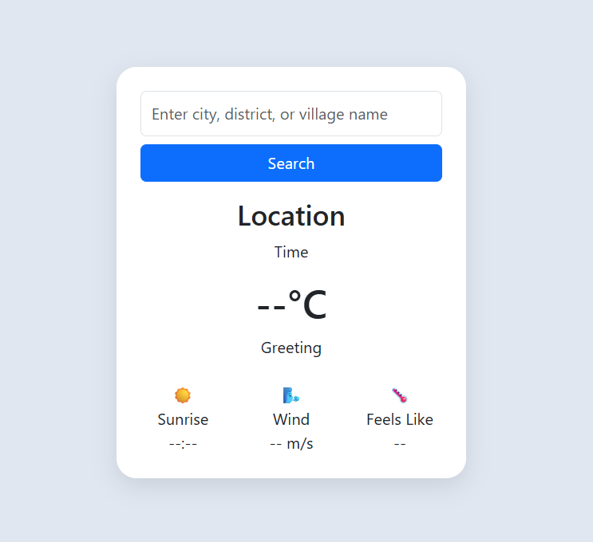
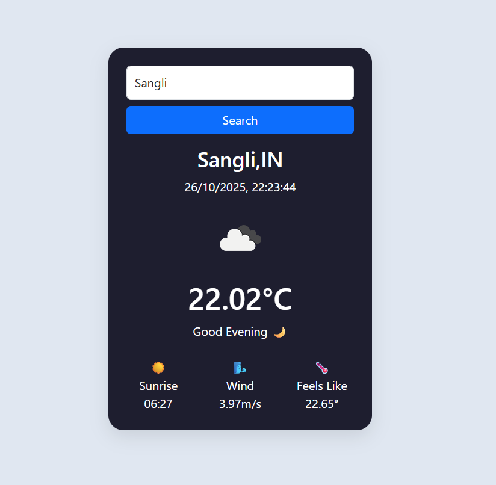

🌤️ **WeatherCheck — Real-Time Weather App**

A simple yet elegant Weather Checking Web App built using HTML, CSS, and JavaScript.This application allows users to search for any location and view real-time weather data.

✨ **Features**

🌍 Fetches live weather data using the OpenWeatherMap API
☀️ Automatic Theme Mode:
-Light mode during daytime
-Dark mode during evening or night
💨 Displays temperature, “feels like” temperature, wind speed, and sunrise time
⏰ Real-time clock and greeting message (Good Morning / Afternoon / Evening)
🎨 Smooth animations with fade-in effects
📱 Responsive design (works perfectly on mobile and desktop)

🛠️ **Technologies Used**

•HTML5 – Structure of the webpage
•CSS3 – Styling, layout, and dark theme design
•JavaScript (ES6) – Logic, DOM manipulation, API fetching
•OpenWeatherMap API – Provides real-time weather information
•Bootstrap 5 – For responsive layout and styling helpers

🚀 **How It Works**
1.Enter your city, district, or village name in the input field.
2.Click “Search”.
3.The app calls the OpenWeatherMap API and fetches weather details.
4.The interface updates dynamically with:
  •Location and current time
  •Temperature, feels like temperature, wind speed, sunrise time
  •Auto light/dark theme and greeting

🖼️ **Screenshots**

  
  

  <em>🌞 Day Mode (Light Theme) &nbsp;&nbsp;&nbsp; 🌙 Night Mode (Dark Theme)</em>

